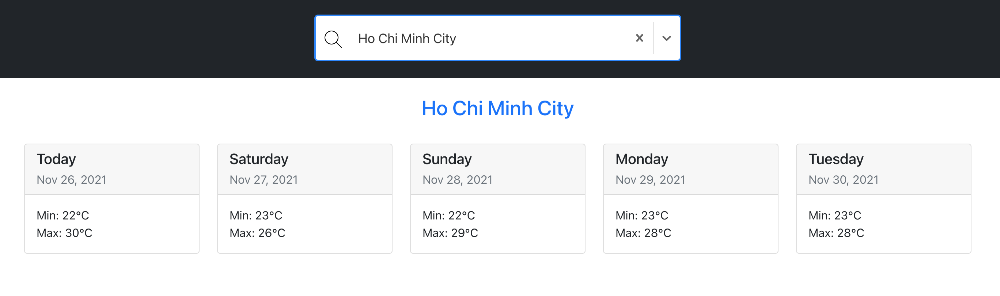

# Weather Forecast Application

Ability to search weather information for five days of any city from over the world.

**Demo:** https://nab-weather-forecast-tan.herokuapp.com

## How to use

1. Type the city name on search input.
2. Select an appropriate city in the suggestion list to view weather information in a week.

## Get Started

### Installation

1. Install [NodeJS](https://nodejs.org/en/download/)
2. Install **Yarn** by command `npm install -g yarn`

**Notice:** You might need to have Node 14.15.0 or later on your local machine.

### Development

1. `git clone https://github.com/tannguyenad/nab-weather-forecast.git`
2. `cd nab-weather-forecast`
3. Run `yarn` to install all dependencies.
4. Run `yart start` to start application on local.

### Testing

Run `yarn test` to launches the test runner in the interactive watch mode.

## License

MIT Licensed. Copyright (c) Tan Nguyen 2021.
